# Python基础

哔哩哔哩：https://www.bilibili.com/video/BV1qW4y1a7fU/?spm_id_from=333.337.search-card.all.click

资料:网盘资料链接：https://pan.baidu.com/s/1KCKkV13ymltq9CMXE3qxJA?pwd=1234  提取码：1234

## 基础语法

### 数据类型

| 类型               | 描述                   | 说明                                                         |
| :----------------- | ---------------------- | :----------------------------------------------------------- |
| 数字  （Number）   | 整数（int）            | 整数（int），如：10、-10                                     |
|                    | 浮点数（float）        | 如：13.14、-13.14                                            |
|                    | 复数（complex）        | 如：4+3j，以j结尾表示复数                                    |
|                    | 布尔（bool）           | 表达现实生活中的逻辑，即真和假，True表示真，False表示假。True本质上是一个数字记作1，False记作0 |
| 字符串（String）   | 描述文本的一种数据类型 | 字符串（string）由任意数量的字符组成                         |
| 列表（List）       | 有序的可变序列         | Python中使用最频繁的数据类型，可有序记录一堆数据             |
| 元组（Tuple）      | 有序的不可变序列       | 可有序记录一堆不可变的Python数据集合                         |
| 集合（Set）        | 无序不重复集合         | 可无序记录一堆不重复的Python数据集合                         |
| 字典（Dictionary） | 无序Key-Value集合      | 可无序记录一堆Key-Value型的Python数据集合                    |

### 注释

单行注释：加#

```python
# 这是一行注释
print("Hello world")
```

多行注释：三个双引号

```python
"""
这是多行注释
注释1
注释2
注释3
"""
print("Hello world")
```

### 变量

使用逗号`,`进行字符串拼接

```python
# 定义一个变量：钱包, 用来存储余额数字
money = 50
# 查看一下，钱包还剩余多少钱
print("money is ", money, " ,money-10=", money - 10)
```

### 数据类型

判断类型：使用`type()`方法，变量类型可以根据赋的值动态改变

```python
name = 1.24
print(type(name))
name = "1.24"
print(type(name))
name = 1 + 2j
print(type(name))
```

### 数据类型转换

- 转化为字符串：`str()` 万物都可以转为字符串
- 转化为数字：`int()`：只有整数才可能，浮点数强转的话会丢失精度，只取整数部分
- 转化为浮点数：`float()`

```python
age = "12"
age_int = int(age)
print(age_int + 1)

age_str = str(age_int)
print(age_str)

age_float = float(age_str)
print(age_float * 1.5)
```

### 标识符

标识符是：变量名，方法名，类名

限制：

1. 内容限定：英文，下划线，数字。并且数字不能用作开头
2. 大小写敏感
3. 不可使用关键字：三个大写字母开头的关键字：`False`，`True`，`None`

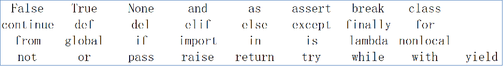

规范：

- 见名知意
- **类名**的命名通常使用驼峰命名法（CamelCase），以区分实例变量和类名
- **变量名**使用下划线命名法，英文字母全小写；

### 运算

```python
# 整除
print(9 // 2)
# 指数2^3 == 8
print(2 ** 3)
# 复合赋值运算
a = 2
a **= 4
print(a)
```

### 字符串扩展

#### 三种定义方式

- 单引号：内部可以包含双引号
- 双引号：内部可以包含单引号
- 三引号：支持换行操作。如果使用变量接受它，它就是字符串；如果不接受，则是多行注释

```python
# 单引号："hello python"
name = '"hello python"'
# 双引号(常用)：'hello python1'
name1 = "'hello python1'"
# 三引号"hello"
#'python2'
name2 = """"hello"
'python2'"""
# 转义："hello"
name3 = "\"hello\""
```

字符串内部如果包含引号，可以有以下策略：

- 如果包含单引号：可以使用双引号来定义
- 如果包含双引号：可以使用单引号来定义
- 如果即包含单引号，又包含双引号：可以使用转移字符来定义。

#### 字符串拼接

只能是字符串之间拼接，不能包含其他类型如整数，浮点数

```python
hello = "hello"
world = "world"
print(hello + " " + world)
```

#### 字符串格式化

常用占位符有哪3个

- 字符串：%s
- 整数：%d
- 浮点数：%f

```python
# 将内容换乘字符串,放入到占位位置
hello = "hello"
name = "world"
age = 11
msg = "%s %s %s" % (hello, name, age)
print(msg)
# 转化为字符串/整数/浮点数后，放入到占位位置
name = "zhangsan"
setup_year = 11
stock_price = 202.33
message = "%s，在%d月份持有基金：%f" % (name, setup_year, stock_price)
print(message)
```

#### 格式化的精度控制

在字符串格式化工程中可以使用`m.n`来控制数据的宽度和精度

- m:控制宽度
- n:控制精度

```python
num2 = 11.345
print("数字11宽度限制5，结果是：%5d" % num2)
print("数字11.345宽度限制7，小数精度2，结果是：%7.2f" % num2)
print("数字11.345不限制，小数精度2，结果是：%.2f" % num2)
```

#### 字符串快速格式化

```python
# 转化为字符串/整数/浮点数后，放入到占位位置
name = "wpc"
setup_year = 11
stock_price = 202.33
print("%s，在%d月份持有基金：%f" % (name, setup_year, stock_price))
# 快速格式化
print(f"{name}，在{setup_year}月份持有基金：{stock_price}")
```

- 不理会类型
- 不做精度控制

#### 表达式格式化

在格式化和快速格式化中，传入的不仅可以使用变量，也可以使用表达式

```python
print("%s，在%d月份持有基金：%f" % (name, setup_year + 1, stock_price / 2))
print(f"{name}，在{setup_year}月份持有基金：{stock_price + 1}")
print(f"{name}，在{setup_year}月份持有基金：type:{type(name)}")
```

### 小练习

```python
name = "wpc"
stock_price = 19.99
stock_code = "003032"
stock_price_daily_growth_factor = 1.2
growth_days = 7

print(f"公司：{name},股票代码：{stock_code},当前股价：{stock_price}")
print("每日增长系数：%.2f，经过%d天的增长后，股价达到了：%.2f" % (stock_price_daily_growth_factor, growth_days, stock_price * stock_price_daily_growth_factor ** growth_days))
```

### 数据输入

`input`函数，内部包含了提示信息。获取到的所有内容都是字符串类型

```python
name = input("Please tell me who you are: ")
print(f"Hello {name}, type: {type(name)}")
```

## 判断语句

### 布尔类型和比较运算

布尔类型，字面量True表示真，字面量False表示假

比较运算： `==` `!=` `>，>=或<,<=`

```python
bool_1 = True
bool_2 = False
print(f"bool_1: {bool_1} type: {type(bool_1)}; {bool_2} type {type(bool_2)}")

print(f"10 == 10? {10 == 10}")
print(f"10 != 15? {10 != 15}")
print(f'"hello == world? {"hello" == "world"}')
print(f" 5 < 10? {5 < 10}")
print(f"5 >= 10? {5 >= 10}")
```

### if语句

基本格式

```python
if 条件:
    操作1
    操作2
```

注意

- 判断条件是布尔类型，不用加括号
- 判断后需要加引号`:`
- 归属于if语句的代码块，需在前方填充4个空格缩进

if条件是根据缩进来操作是否完成

```python
age = 30
if age >= 18:
    print("is adult")
    print("will go to college")
print("Done")
```

练习

```python
print("Welcome to children park,children free, but adult need pay")
age = int(input("Please input your age:"))
if age >= 18:
    print("You is adult, need to pay 10 yuan")
print("Have a good time")
```

### if else语句

基本格式

```python
if 条件:
    操作1
    操作2
else:
    操作1
    操作2
```

```python
print("Welcome to children park,children free, but adult need pay")
age = int(input("Please input your age:"))
if age >= 18:
    print("You is adult, need to pay 10 yuan")
else:
    print("you are children, free")
print("Have a good time")
```

### if elseif else语句


基本格式

```python
if 条件1:
    操作
elif 条件2:
    操作
else:
    操作
```

示例代码

```python
record = int(input("Please input your record: "))
if record < 60:
    print("not pass")
elif record < 70:
    print("pass")
elif record < 80:
    print("middle")
elif record < 90:
    print("good")
elif record <= 100:
    print("best")
else:
    print("input error")
```

### 判断语句的嵌套

基本格式

```python
if 条件1:
    操作
    操作
    if 条件2:
        操作
        操作
```

实例代码

```python
if int(input("please input your height: ")) > 120:
    print("height more than limit, don't free")
    if int(input("please input your vip level: ")) > 3:
        print("your vip reach the standard, free")
    else:
        print("Sorry, need pay the ticket")
else:
    print("free")
```

## 循环

### while循环

基本语法

```python
while 条件:
    操作
    操作
```

注意：

1. 条件是布尔类型
2. 根据缩进来判断循环体的操作
3. 规划化循环条件，防止死循环

案例1：1到100的和

```python
sum_100 = 0
i = 1
while i <= 100:
    sum_100 += i
    i += 1
print(f"1+...100={sum_100}")
```

案例2：猜数字

```python
import random

target = random.randint(1, 100)
count = 1
guess_num = int(input("please input a assume: "))
while guess_num != target:
    if guess_num < target:
        print("guess num is less than target")
    else:
        print("guess num is more than target")
    count += 1
    guess_num = int(input("please input a assume: "))
print(f"Target num is {target}, you guess count is :{count}")
```

### while嵌套循环

基本语法

```python
while 条件1:
    操作
    操作
    while 条件2:
        操作
        操作
```

九九乘法表

```python
i = 1
while i <= 9:
    j = 1
    while j <= i:
        print(f"{j} * {i} = {i * j}\t", end="")
        j += 1
    i += 1
    print()
print("Done")
```


### for循环

基本语法

```python
for 临时变量 in 待处理数据集:
    操作
```

注意：

- 无法定义循环条件
- 循环内的语句，要有空格缩进

案例

```python
name = "Hello world"
for i in name:
    print(i)
```

### for rang

基本语法：
```python
for range(num):
    操作
for range(start,end):
    操作
for range(start,end,step):
    操作
```

案例

```python
# 0,1,2,3,4,
for i in range(5):
    print(i, end=',')
print()
# 2,3,
for i in range(2, 4):
    print(i, end=',')
print()
# 1,4,7,
for i in range(1, 10, 3):
    print(i, end=',')
```

### for嵌套循环

```python
for 变量 in 序列:
    操作
    for 变量 in 序列:
        操作
```

案例

```python
for i in range(1, 10):
    for j in range(1, i + 1):
        print(f"{j} * {i} = {j * i}\t", end="")
    print()
print("Done")
```

### 循环中断continue和break

continue中断当前的一次循环操作，继续循环

```python
for 变量 in 序列:
    操作
    continue
```

break中断循环体，直接退出循环体。

```python
for 变量 in 序列:
    操作
    break
```

## 函数

### 定义

语法

```python
def 函数名(参数):
    函数体
    return 返回值
```

注意：

- 参数可以省略
- 返回值可以省略
- 先定义才能调用

案例

```python
# 定义函数
def say_hi():
    print("Hi I am wpc")


# 调用函数
say_hi()

```

### 参数/返回值

案例

```python
def add(x, y):
    return x + y

x = 1
y = 2
print(f"{x} + {y} = {add(1, 2)}")
```

### None类型

无返回值类型的函数其实返回了None

 ```python
 def say_hi():
     print("Hi I am wpc")
 
 
 # 调用函数
 result = say_hi()
 # 返回的内容是None, 类型是 <class 'NoneType'>
 print(f"无返回值函数，返回的内容是{result}, 类型是 {type(result)}")
 ```

但在if判断上，None等同于False，在函数中配合if条件组合使用

```python
def check_age(age):
    if age > 18:
        return "Success"
    # 下面的else可以省略
    else:
        return None


result = check_age(16)
if not result:
    print("未成年")
```

也可以赋值给一个无初始化内容的变量，后续在进行复制

```python
name=None
```

### 函数文档

语法

```python
def 函数名(参数):
    """
    函数说明
    :paramx: 形参的说明
    :return: 返回值的说明
    """
    函数体
    return 返回值
```

Tip: 

1. pycharm可以在函数名下面打上三个双引号回车，自动补齐参数和返回值
2. 鼠标悬浮在调用处，可以查看函数文档

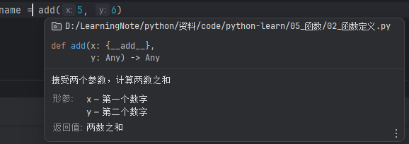

案例

```python
def add(x, y):
    """
    接受两个参数，计算两数之和
    :param x: 第一个数字
    :param y: 第二个数字
    :return: 两数之和
    """
    print("两数之和")
    return x + y
```

### 函数嵌套调用

语法

```python
def func1():
    操作

def func2():
    操作
    func1()
```

### 变量作用域

1. 函数体内的变量为局部变量，不能在函数外部使用。
2. 外部变量可以在函数体内使用，但是不能修改
3. 如果要修改，需要在函数体内定义一个global的同名变量进行关联，然后在进行修改

```python
# 全局变量
num = 10

def add():
    # 局部变量
    num = 1
    return num

print(f"add num is {add()}")
print(f"num is {num}")

```


```python
# 全局变量
num = 10


def add():
    # 链接内部变量和外部变量，然后进行修改
    global num
    num = 20


add()
print(num)
```

## 数据容器（集合）

数据容器根据特点的不同，如：是否支持重复元素是否可以修改是否有序，等分为5类，

分别是：列表（list）、元组（tuple）、字符串（str）、集合（set）、字典（dict）

### 列表list

语法

```python
# 定义和初始化
变量名=[元素1,元素2，元素3,...]

# 定义空列表
变量名=[]
变量名=list()

# 获取数据
变量名[下标]

# 嵌套列表
变量名[下标][下标]

# while遍历
index = 0
while index < len(列表):
    操作
    index += 1

# for遍历
for 变量 in 列表:
    操作
```

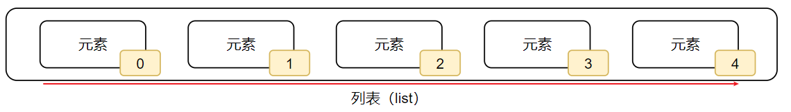

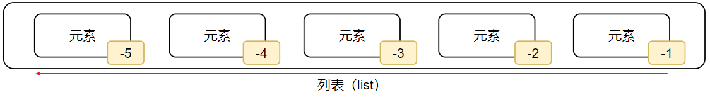

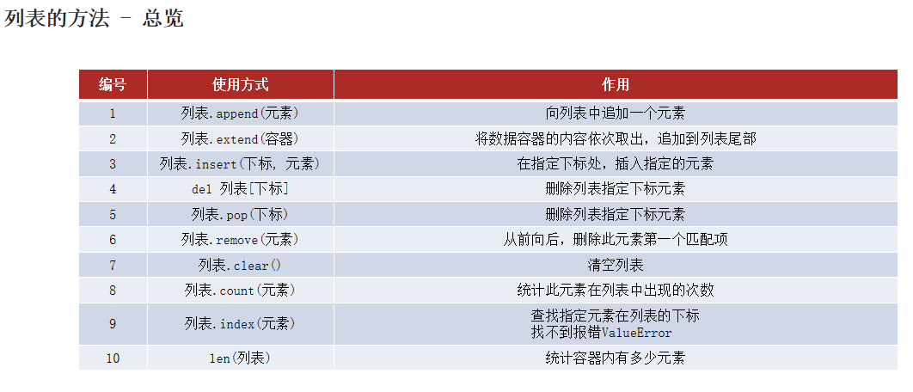

特点：

1. 可以容纳多个元素
2. 可以容纳不同类型元素
3. 数据有序存储
4. 允许重复数据
5. 可以修改

案例

```python
name_list = ["1", 66, True, 2.3, 4]
print(f"{name_list}, ${type(name_list)}")

my_list = [[1, 2, 3], ["1", "2", "3"], [True, False], [1.1, 2.2]]
print(f"{my_list},{type(my_list)}") 

#获取到指定下标的数据，默认从0开始；也可以反向取从右向左，从-1开始依次减少
print(f" name_list[0] value is {name_list[0]}, type is {name_list[0]}")
print(f" name_list[-5] value is {name_list[-5]}, type is {name_list[-5]}")
// True
print(f" name_list[0] == name_list[-5] {name_list[0] == name_list[-5]}")
```

操作

```python
# 1.索引：如果索引不在，将会报错
my_list = ["1", "2", "3"]
index = my_list.index("1")
print(f"1 在列表中的索引是：{index}")

# 2.修改
my_list[0] = "0"
print(f"第一个位置的值是{my_list[0]}")

# 3.插入
my_list.insert(1, "1")
print(f"当前列表中的数据为：{my_list}")

# 4追加
my_list.append("4")
print(f"当前列表长度为：{len(my_list)}")

# 5 追加一批
new_list = ["5", "6", "7"]
my_list.extend(new_list)
print(f"当前列表长度为：{len(my_list)}")

# 6 删除del
del my_list[7]
print(f"当前列表中的数据为：{my_list}")
# 6.2 删除并取出值：pop
num = my_list.pop(2)
print(f"当前列表中的数据为：{my_list}")
# 6.3 移除第一个匹配项
my_list.remove("5")
print(f"当前列表中的数据为：{my_list}")

# 7 清空列表
my_list.clear()
print(f"当前列表中的数据为：{my_list}")

my_list = ["1", "2", "3"]

# 8 统计某元素在列表内的数量
count = my_list.count("2")
print(f"2在列表中的数量为：{count}")

# 9 统计总元素数量
count = len(my_list)
print(f"列表中的数量为：{count}")
```

### 元组tuple

元组和列表一样，可以封装多个不同类型的元素，但不允许修改（增删改）。

语法

```python
# 1.定义
(元素1,元素2,元素3)
变量名=(元组1,元组2,元组3)
变量名=tuple()
# 1.1 只有一个元素
变量名=(元素1,)
# 1.2 元组嵌套
变量名=((元组1),(元组2))
# 1.3 获取值
变量名[下标]

# 2.常用操作
# 2.1 查询索引下标
变量名.index()
# 2.2 统计某个字符串的个数
变量名.count()
# 2.3 统计长度
变量名.len()
# 2.4 while遍历
index=0
while index<变量名.len():
    操作
    index+=1
# 2.5 for遍历
for element in 变量名:
    操作
```

注意：

- 如果只有一个元素的话，需要在尾部加上逗号

### 字符串Str

同元组一样，字符串是一个：无法修改的数据容器。

语法

```python
# 常用操作
# 1 查询指定字符串索引
字符串.index(s1)
# 2 查找替换
字符串.replace(s1,s2)
# 3 字符串根据分隔符分割
字符串.split(分隔符)
# 4 规整操作,默认除去头和尾的空格；如果传参数，则根据传入的参数取出头尾内容
字符串.strip()
# 5 统计某个字符出现的次数
字符串.count()
# 6 统计字符串的长度
字符串.len()
```

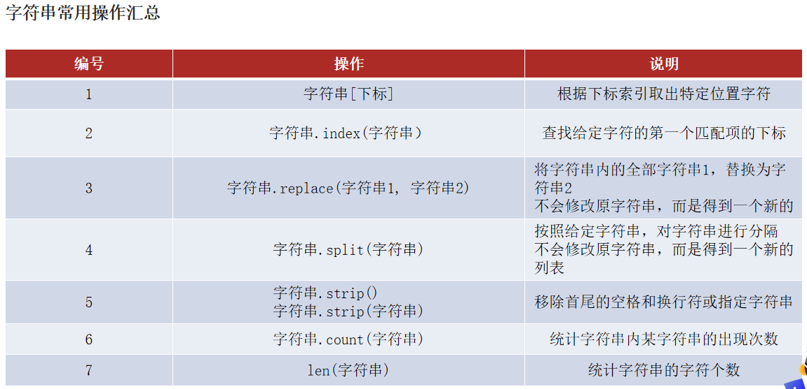

### 序列切片

列表、元组、字符串均是序列

切片：从一个序列中取出一个子序列，不是修改序列，而是新建一个序列

语法：序列[起始下标:结束下标:步长]

- 起始下标（包含）表示从何处开始，如果留空，表示从头开始
- 结束下标（不含）表述何处结束，如果留空表示截取到结尾
- 步长表示取元素的间隔

案例

```python
my_list = [0, 1, 2, 3, 4, 5, 6]

# 正序取的话，起始下标小于结束下标
# [1, 2, 3]
print(my_list[1:4])
# [0]
print(my_list[:1])
# [0, 2, 4, 6]
print(my_list[::2])

# 倒序取的话，起始下标大于结束下标
# [6, 4, 2, 0]
print(my_list[::-2])
# [3, 2, 1, 0]
print(my_list[3::-1])
# [5, 4, 3, 2]
print(my_list[5:1:-1])
```

### 集合Set

- 无序，
- 不可重复的序列
- 不支持下标索引

语法

```python
# 定义
{元素1,元素2,元素3}
变量名={元素1,元素2,元素3}
变量名=set()
# 操作
# 添加
变量名.add()
# 移除
变量名.remove()
# 随机弹出一个
变量名.pop()
# 清空
变量名.clear()
# 取出两个集合的差集并生成一个新的集合
set1.difference(set2)
# 消除差集并更新原集合
set1.difference_update(set2)
# 合并两个集合并生成一个新的集合
set1.union(set2)
# 集合元素数量
set.len()
# 集合遍历只能用for，不能用while
for i in set:
    操作
```

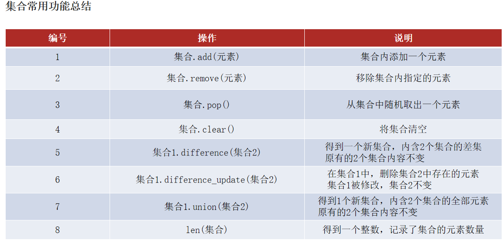

### 字典（Dictionary)

存储key value键值对

```python
# 定义
{key1:value1,key2:value2,key3:value3}
变量={key1:value1,key2:value2,key3:value3}
变量={}
变量=dict()

# 获取某个key的value
变量[key]

# 字典可以嵌套，但是key不能是字典类型
变量={key,字典}

# 操作
#  新增(更新)
变量[key]=value
#  删除(弹出)
变量.pop[key]
#  清空
变量.clear()
#  获取所有的key
变量.keys()
#  遍历
for key in 字典.keys():
    操作
for e in 字典:
    操作
# 统计key中元素的个数
len(变量)

```

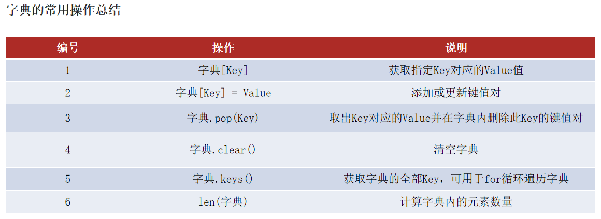

案例

```python
stu = {
    "wlh": {"Chinese": 30, "math": 20, "english": 88},
    "zjl": {"Chinese": 52, "math": 38, "english": 45},
    "ljj": {"Chinese": 77, "math": 96, "english": 22}
}

print(stu["wlh"]["Chinese"])
```

### 总结

数据容器可以从以下视角进行简单的分类：

语法：

- 列表使用：[]
- 元组使用：()
- 字符串使用：""
- 集合使用：{}
- 字典使用：{}

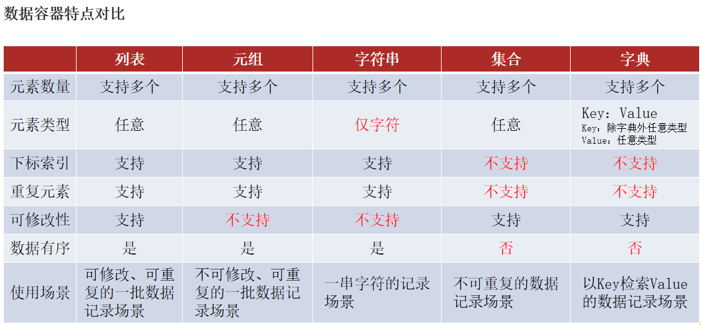

通用操作：如果涉及到排序：数字是直接对比，字符串是根据ASCII码

- len: 统计元素个数`len(容器)`
- max：获取到容器中最大的元素`max(容器)`，
- min：获取到容器最小的`min(容器)`
- 容器之间转化：`list(容器)`，`str(容器)`，`tuple(容器)`，`set(容器)`
- sort: 容器数据排序`sort(容器)`，返回值类型是列表；`sort(容器,reverse=True)`倒序

## 函数进阶

### 函数多返回值

如果一个函数要有多个返回值

语法：

```python
def 函数名:
    return 结果1,结果2,...

变量1,变量2 = 函数名()
```

案例：

```python
# 演示使用多个变量，接收多个返回值
def test_return():
    return 1, "hello", True

x, y, z = test_return()
print(x)
print(y)
print(z)
```


### 函数多种传参方式


语法

```python
# 1.位置参数
def 函数名(参数1,参数2,参数3):
    操作
    
# 2.关键字参数,可以和位置参数函数混用，但位置参数必须放在关键字参数前面
def 函数名(key1,key2,key3):
    操作
函数名(key1=value,key2=value,key3=value)

# 3.缺省参数,必须写在最后。
def 函数名(参数1,参数2,参数3=默认值):
    操作
# 调用时可填可不填，如果不填就使用默认值
函数名(k1,k2)
函数名(k1,k2,k3)

# 4.可变参数
# 4.1 位置传递不定长，默认不定长参数是元组类型
def 函数名(*args):
    操作
# 4.2 关键字传递不定长，默认不定长参数是字典类型
def 函数名(**kwagrs):
    操作
```

案列

```python
def user_info(name, age, gender="man"):
    print(f"name is {name}, age is {age}, gender is {gender}")

# 1.位置参数调用，每一个参数必须和函数对应
user_info("xiaoming", 12, 'man')
user_info(name="xiaowang", age=11, gender="woman")
# 2.关键字参数参数位置可以随意调整
user_info(gender="woman", name="xiaoxiao", age=10)
# 位置参数和关键字参数混用，但是关键字参数必须在位置参数后
user_info(name="tiantian", gender="girl", age=7)
# 3. 默认缺省参数调用时，可以不用传递缺省参数
user_info("xiaotian", 12)

# 4可变参数
# 4.1位置不定长参数
def user_info2(*args):
    print(f"the args type is {type(args)}, and the value is {args}")
# the args type is <class 'tuple'>, and the value is ('xiaozhang', 32, 'man')
user_info2("xiaozhang", 32, 'man')

# 4.2关键字不定长参数
def user_info3(**kwargs):
    print(f"the args type is {type(kwargs)}, and the value is {kwargs}")
# the args type is <class 'dict'>, and the value is {'name': 'xiaozhang', 'age': 32, 'gender': 'man'}
user_info3(name="xiaozhang", age=32, gender='man')
```

### 匿名函数

#### 函数作为参数传递

函数可以作为参数传递，可以理解为函数嵌套，语法

```python
def 函数1(函数2):
    操作
    函数2()

def 函数2(参数,参数):
    操作
```

案例

```python
# 定义一个函数，接收另一个函数作为传入参数
def test_func(compute, x, y):
    result = compute(x, y)  # 确定compute是函数
    print(f"compute参数的类型是:{type(compute)}")
    print(f"计算结果：{result}")

# 定义两个函数，准备作为参数传入另一个函数
def add(x, y):
    return x + y
def sub(x, y):
    return x - y

# 调用，并传入函数add，计算结果：3
test_func(add, 1, 2)
# 调用，并传入函数sub，计算结果：-1
test_func(sub, 1, 2)
```

#### Lambda匿名函数

函数定义有两种类型

- def关键字，可以定义带有名称的函数，可以重复使用
- lambda关键字，可以定义匿名函数（无名称），只可临时使用一次

语法：

```python
lambda 参数: 函数体(只能写一行代码)
```

案例

```python
# 定义一个函数，接受其它函数输入
def test_func(compute, x, y):
    result = compute(x, y)
    print(f"结果是:{result}")

# 通过lambda匿名函数的形式，将匿名函数作为参数传入
def add(x, y):
    return x + y

# 1+1=2
test_func(add, 1, 1)
# 1+1=2
test_func(lambda x, y: x + y, 1, 1)
# 1-1=0
test_func(lambda x, y: x - y, 1, 1)
# 1*1=1
test_func(lambda x, y: x * y, 1, 1)
# 1/1=1
test_func(lambda x, y: x / y, 1, 1)
```

## 文件操作

### 读取文件

主要包括打开，关闭，读，写四类操作。

`open(name,mode,encoding)`

- name:打开的文件名名
- mode: 打开模式：只读(r,默认模式)，写入(w)，追加(a)等
- encoding: 编码格式（推荐使用UT-8)

例如`f=open("python.txt",'r','UTF-8')`

```python
# 1.打开文件
f = open("a.txt", "r", encoding="UTF-8")
# 2.读取文件,10个字符和全部，多次调用read，后续的read会接着前面的位置继续读
print(f.read(10))
print(f.read())
# 3.读取文件的全部行,继续前面读取的位置读
print(f.readlines())
# 4.读取文件的一行
print(f.readline())
# 5.for循环遍历文件
for line in f:
    print(f"每一行的数据是：{line}")
# 6.关闭文件
f.close()
# 7.with open自动完成文件的关闭
with open("a.txt", "r", encoding="UTF-8") as f1:
    print(f1.readlines())
```

### 写入文件

语法

```python
# 1.打开文件
f = open(文件,'w')
# 2.写数据到内存
f.write(内容)
# 3.将内存中的数据刷到磁盘
f.flush()
# 3.close也内置了刷新方法
f.close()
```

案列

```python
# 文件不存在会自动创建,存在的话,会清空文件后重新写入
f = open("b.txt", 'w', encoding="UTF-8")
# 写到内存中
f.write("Hello world!!!!")
# 将内存中的数据刷新到磁盘文件中
f.flush()
# close也内置了刷新功能
f.close()
```

### 追加操作

和写入文件基本类似，除了模式需要换位append`f = open(文件,'a')`

```python
f = open("c.txt", "a", encoding="UTF-8")
f.write("Hello python\n")
f.close()
```

## 异常/模块/包

### 异常

#### 异常捕获

如何捕获异常，语法

```python
# 1.捕获全部的异常
try:
    可能发生错误的代码
except [Exception] as e:
    如果出现异常了将要执行的代码
else:
    没有异常时的代码
finally:
    无论有没有异常，最终都会执行
  
# 2. 捕获指定异常
try:
    代码
except 异常1:
    代码
except 异常2:
    代码
    
# 3.同时捕获多个异常
try:
    代码
except (异常1,异常2) as e:
    代码
```

```python
# 1.捕获所有异常
try:
    f = open("a.txt", "r")
except:
    print("出现了异常...")
    f = open("a.txt", "w")
else:
    print("没有异常")
finally:
    print("有没有异常，都会执行")

    
# 2.捕获指定异常
try:
    f = open("a.txt", "r", encoding="UTF-8")
    name = 1
    print(name)
    n = 1 / 0
except FileNotFoundError as e:
    print(f"出现了文件找不到的异常...{e}")
except NameError as n:
    print(f"出现变量未定义的异常...{n}")
except ZeroDivisionError as z:
    print(f"除数是0的异常{z}")

# 3.同时捕获多种类型
try:
    f = open("a.txt", "r", encoding="UTF-8")
    name = 1
    print(name)
    n = 1 / 0
except (NameError, ZeroDivisionError, NameError) as e:
    print(f"同时捕获多个异常,异常类型是：{e}")
```

#### 异常传递

当前如果抛出异常并且没有捕获的话，会传递给上层调用者，直至捕获为止。

如果都没有捕获会停止程序运行，打印调用栈，最下面的是抛出异常的代码

```python
def func1():
    print("开始执行func1")
    num = 1 / 0
    
def func2():
    print("开始执行func2")
    func1()

def main():
    print("开始执行main函数")
    func2()

main()
```

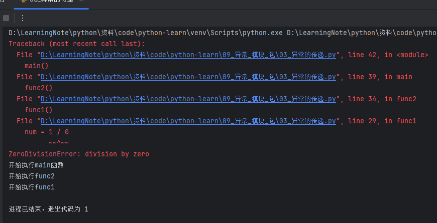

### 模块

#### 模块的导入

模块的导入方式

语法

```python
[from 模块名] import [模块|类|变量|函数|*] [as 别名]

import 模块1,模块2
模块名.功能名()

from 模块名 import 功能名
功能名()
```

常用组合形式

```python
# 导入模块的全部功能
import 模块名
import 模块名 as 别名
# 只导入模块中的某些或全部功能
from 模块名 import 类、变量、方法等
from 模块名 import *
from 模块名 import 功能名 as 别名
```

案例：

```python
# 1.导入python内置的time模块,可以使用time模块的所有功能
import time

print("Hello")
time.sleep(5)
print("World")

# 使用别名，有时候模块名非常长，可以使用别名简化
import time as tt

print("Hello")
tt.sleep(5)
print("World")
```

```python
# 2.只导入Python模块中的sleep方法
from time import sleep

print("Hello")
sleep(5)
print("World")

# 使用别名，自定义方法的名字
from time import sleep as sl

print("Hello")
sl(5)
print("World")
```

```python
# 3.导入time模块的所有方法，而且在使用时，不用使用time.就可以直接调用
from time import *

print("Hello")
sleep(5)
print("World")
```

#### 自定义模块

如何自定义模块：新建一个python文件，并在其中定义函数即可，模块名称就是文件名，要符合标识符的规定

```python
# my_module1.python文件
def test_a(x, y):
    print(x + y)
    
# my_module2.python文件
def test_a(x, y):
    print(x - y)

# 其他调用文件引入自定义模块，并使用内部方法
from my_module1 import *
test_a(1, 2)

# 如果两个模块的方法名是一样的，那么使用最后一个模块，
# 后面的会把前面的给覆盖掉
from my_module1 import test_a
from my_module2 import test_a
test_a(1, 2)
```

#### 两个内置变量

- `__name__`

```python
# python文件中有一个内置变量__name__
# 当直接运行python文件时，__name__等于__main__，当导入这个文件时，__name__等于文件名
print(f"__name__ is {__name__}")
# 因此，如果你想测试某个文件，但又不想在导入时调用它，可以使用if __name__ == '__main__':的方法过滤时
if __name__ == '__main__':
    test_a(1, 2)
```

- `__all__`

  ```python
  # 当使用# from 模块名 import *时，默认导入的是模块的全部方法，
  # 这个因为内置变量__all__默认是全部的方法
  # 如果在文件中定义了这个变量，将控制当import *时哪些方法可以导入，其他的不能导入
  ```

  ```python
  # my_module1.py文件，定义两个函数，但对于import *只开放test_a方法
  __all__ = ["test_a"]
  
  
  def test_a(x, y):
      print(x + y)
  
  
  def test_b(x, y):
      print(x - y)
      
  # 调用方文件
  from my_module1 import *
  test_a(1, 2)
  # 报错
  test_b(2, 1)
  ```


### 包

从物理上看，包就是一个文件夹，在该文件夹下包含一个`__init__.py`文件，该文件夹可以包含多个模块文件。

有`__init__.py`文件时一个包，没有就是一个普通的文件夹

#### 自定义包

语法

```python
import 包名.模块名
包名.模块名.方法名()

from 包名 import 模块名
模块名.方法名()

from 包名.模块名 import 方法名
方法名()
```

创建一个python包，会自动生成`__init__.py`文件

```python
# 在pc_package下创建hello_world.py文件
def hw():
    print("Hello world")
    
# 1.1导入包名.模块名
import pc_package.hello_world
pc_package.hello_world.hw()

# 1.2 from包名导入模块名
from pc_package import hello_world
hello_world.hw()

# 1.3 form 包名.模块名 import 方法名
from pc_package.hello_world import hw
hw()
```

#### `__init__.py`内置变量

导入*时，内部用一个`__all__`变量来控制包内的哪些模块可以使用，默认不写，是包内的全部模块都可以使用

```python
# 在__init__.py文件中定义只能使用hello_world模块
__all__ = ["hello_world"]
 
# 在调用时，只能调用hello_world，hello_world2无法调用，报错
from pc_package import *

hello_world.hw()
hello_world2.hw()
```

#### 第三方包

- 科学计算中常用的：numpy包
- 数据分析中常用的：pandas包
- 大数据计算中常用的：pyspark、apache-flink包
- 图形可视化常用的：matplotlib、pyecharts
- 人工智能常用的：tensorflow

安第三方包pip

```cmd
pip install 包名称
pip install -i https://pypi.tuna.tsinghua.edu.cn/simple 包名称
```


## 数据可视化

### Json

Json类型在python中是字符串类型

可以和python对象（字典或者列表）之间的相互转化，语法：

```python
import json

# 1.将python对象转化为json
json_str = json.dump(对象)

# 2.将json字符串转化为python对象
对象 = json.loads(json_str)
```

案例

```python
import json

# python对象转json字符串 json_str类型是str
data = [{"name": "张大山", "age": 11}, {"name": "王大锤", "age": 13}, {"name": "赵小虎", "age": 16}]
json_str = json.dumps(data, ensure_ascii=False)
print(f"json_str is {json_str} type is {type(json_str)}")

d = {"name": "周杰轮", "addr": "台北"}
d_str = json.dumps(d, ensure_ascii=False)
print(f"d is {d_str} type is {type(d_str)}")

# 字符串转python对象，用loads(),转化为type is <class 'list'>
s = '[{"name": "张大山", "age": 11}, {"name": "王大锤", "age": 13}, {"name": "赵小虎", "age": 16}]'
my_list = json.loads(s)
print(f"d is {my_list} type is {type(my_list)}")
```

### pyecharts

Echarts 是一个由百度开源的数据可视化组件库

官网：https://pyecharts.org/#/zh-cn/intro

`pip install pyecharts`

### 折线图

```python
# 导包
from pyecharts.charts import Line

# 创建一个折线图对象
line = Line()
# 给折线图对象添加x轴的数据
line.add_xaxis(["中国", "美国", "英国"])
# 给折线图对象添加y轴的数据
line.add_yaxis("GDP", [30, 20, 10])

# 通过render方法，将代码生成为图像
line.render()
```

设置全局配置项

```python
# 设置全局配置项set_global_opts来设置,
line.set_global_opts(
    title_opts=TitleOpts(title="GDP展示", pos_left="center", pos_bottom="1%"),
    legend_opts=LegendOpts(is_show=True),
    toolbox_opts=ToolboxOpts(is_show=True),
    visualmap_opts=VisualMapOpts(is_show=True),
)
```

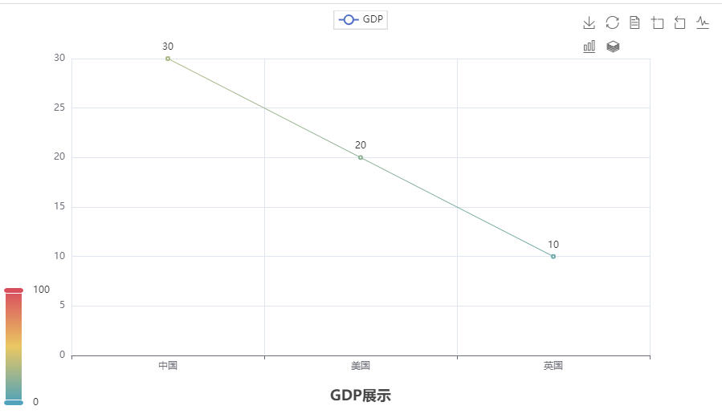

### 地图

```python
from pyecharts.charts import Map
# 准备地图对象
map = Map()
# 添加数据
data = [
    ("北京市", 99),
    ("上海市", 199),
    ("湖南省", 299),
    ("台湾省", 399),
    ("广东省", 499)
]
map.add("测试地图", data, "china")

# 绘图
map.render()
```

设置全局变量

```python
# 设置全局选项
map1.set_global_opts(
    visualmap_opts=VisualMapOpts(
        is_show=True,
        is_piecewise=True,
        pieces=[
            {"min": 1, "max": 9, "label": "1-9", "color": "#CCFFFF"},
            {"min": 10, "max": 99, "label": "10-99", "color": "#FF6666"},
            {"min": 100, "max": 500, "label": "100-500", "color": "#990033"}
        ]
    )
)
```

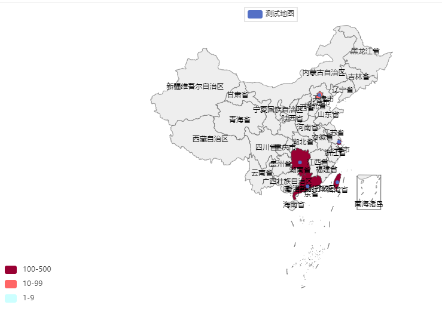

### 柱状图

```python
from pyecharts.charts import Bar
from pyecharts.options import LabelOpts
# 使用Bar构建基础柱状图
bar = Bar()
# 添加x轴的数据
bar.add_xaxis(["中国", "美国", "英国"])
# 添加y轴数据
bar.add_yaxis("GDP", [30, 20, 10], label_opts=LabelOpts(position="right"))
# 反转x和y轴
bar.reversal_axis()
# 绘图
bar.render("基础柱状图.html")
```


# Python高阶


## 面向对象

### 类的定义

语法

```python
# 定义
class 类名:
    成员变量
    
    成员方法(self):
        操作
    
# 创建
变量名 = 类名()

# 为对象赋值
变量名.属性 = value

# 调用对象
变量名.成员方法()

```

案例

```python
# 1.定义类、成员变量和成员方法
class Student:
    name = None
    age = None
    gender = None

    def say_hello(self):
        print(f"hello My name is {self.name}, age is {self.age}, gender is {self.gender}")

    def say_hello2(self, msg):
        print(f"hello My name is {self.name}, {msg}")


# 2.创建类实例
student = Student()

# 3.为对象赋值
student.name = 'zjl'
student.age = 12
student.gender = 'man'

# 4.调用对象方法
student.say_hello()
student.say_hello2("welcome to shanghai")
```

```python
import winsound

class Clock:
    id = None
    price = None

    def ring(self):
        winsound.Beep(2000, 3000)

clo = Clock()
clo.id = '003032'
clo.price = 19.99
clo.ring()
print(f"闹钟id is {clo.id},价格是:{clo.price}")
```

### 内置方法

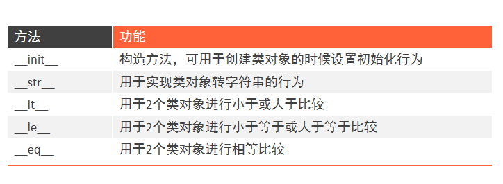

#### `__init__`

Python类可以使用：`__init__()`方法，称之为构造方法。

如果在构造方法上设置成员变量的话，那么成员变量的定义就可以省略了

语法

```python
class 类名:
    成员变量
    
    def __init__(self,参数):
        self.成员变量 = 参数
```

案例

```python
# 演示使用构造方法对成员变量进行赋值 构造方法的名称：__init__
# 使用构造方法后就可以省略成员变量的定义

class Student:

    def __init__(self, name, age, tel):
        self.name = name
        self.age = age
        self.tel = tel
        print("Student类创建了一个类对象")


stu = Student("zjl", 31, "18500006666")
print(f"student name is {stu.name}, age is {stu.age}, tel is {stu.tel}")

```

#### `__str__`

默认打印对象时，会打印对象的内存地址

如果重写了这个内置方法，可以修改对象转化为字符串的值

```python
# 修改前<__main__.Student object at 0x0000023FA71345C0>
print(Student("周杰轮", 31))  

# 重写了__str__后
def __str__(self):
    return f"Student类对象，name:{self.name}, age:{self.age}"

# 修改后：Student类对象，name:周杰轮, age:31
print(Student("周杰轮", 31))
```

#### `__lt__`

对象之间进行比较，如果不重写`__lt__`方法时，如果进行对象对比，则会报错

```python
# 重写前调用会报错：TypeError: '>' not supported between instances of 'Student' and 'Student'
stu1 = Student("周杰轮", 31)
stu2 = Student("林俊节", 36)
print(stu1 > stu2)

# 重写__lt__魔术方法
def __lt__(self, other):
    return self.age < other.age

# 重写后：False
stu1 = Student("周杰轮", 31)
stu2 = Student("林俊节", 36)
print(stu1 > stu2)
```

#### `__le__`

对象之间小于等于比较，如果不重写，调用<=或者>=时会报错

```python
# 重写前调用会报错：TypeError: '>=' not supported between instances of 'Student' and 'Student'
stu1 = Student("周杰轮", 31)
stu2 = Student("林俊节", 36)
print(stu1 >= stu2)

# 重写__le__方法
def __le__(self, other):
    return self.age <= other.age

# 重写后：False
stu1 = Student("周杰轮", 31)
stu2 = Student("林俊节", 36)
print(stu1 >= stu2)
```

#### `__eq__`

对象之间比较是否相等，如果不重写，调用==不会报错，但是比较的是内存中的地址

```python
# 重写前:False
stu1 = Student("周杰轮", 36)
stu2 = Student("林俊节", 36)
print(stu1 == stu2)

# 重写
def __eq__(self, other):
    return self.age == other.age

# 重写后，True
stu1 = Student("周杰轮", 36)
stu2 = Student("林俊节", 36)
print(stu1 == stu2)
```

### 三大特性

#### 封装

定义私有，私有变量和方法只能被类使用，不能被对象使用

- 私有成员变量：变量名以__开头（两个下划线）
- 私有成员方法：方法名以__开头（两个下划线）

```python
# 定义一个类，内含私有成员变量和私有成员方法
class Phone:
    __current_voltage = 0.5  # 当前手机运行电压

    def __keep_single_core(self):  # 定义私有成员方法
        print("让CPU以单核模式运行")

    def call_by_5g(self):  # 定义公共成员方法
        if self.__current_voltage >= 1:
            print("5g通话已开启")
        else:
            self.__keep_single_core()
            print("电量不足，无法使用5g通话，并已设置为单核运行进行省电。")

phone = Phone()
# 调用报错，没有这个属性
print(phone.__current_voltage)
# 调用报错，没有这个方法
phone.__keep_single_core()
# 能够正常调用
phone.call_by_5g()
```

#### 继承

语法

```python
# 单继承
class 类型(父类):
    类内容体

# 多继承,如果变量或方法重名，优先用第一个，先到先得
class 类型(父类1,父类2,父类3..):
    类操作体
```

单继承案例
```python
# 定义基类
class Phone:
    IMEI = None  # 序列号
    producer = "ITCAST"  # 厂商

    def call_by_4g(self):
        print("4g通话")

# 定义子类
class Phone2022(Phone):
    face_id = "10001"  # 面部识别ID

    def call_by_5g(self):
        print("2022年新功能：5g通话")

# 新建一个子类并调用父类的变量和方法
phone = Phone2022()
print(phone.producer)
phone.call_by_4g()
phone.call_by_5g()
```

多继承案例

```python
# 第一个基类
class Phone:
    IMEI = None  # 序列号
    producer = "ITCAST"  # 厂商

    def call_by_4g(self):
        print("4g通话")

# 第二个基类
class NFCReader:
    nfc_type = "第五代"
    producer = "HM"

    def read_card(self):
        print("NFC读卡")

# 第三个基类
class RemoteControl:
    rc_type = "红外遥控"

    def control(self):
        print("红外遥控开启了")
 
# 定义子类，继承三个父类，如果没有其他代码，可以使用·pass·占位
class MyPhone(Phone, NFCReader, RemoteControl):
    pass        

# 分别调用第一个，第二个和第三个基类方法
phone = MyPhone()
phone.call_by_4g()
phone.read_card()
phone.control()

# 打印结果是ITCAST，是第一个父类的结果
print(phone.producer)
```

重写父类方法：子类继承父类的成员属性或成员方法后，可以对其重写

```python
class 基类:
    成员变量
    成员方法
    
class 子类(基类):
    成员变量
    成员方法
```

```python
class Phone:
    IMEI = None  # 序列号
    producer = "ITCAST"  # 厂商

    def call_by_5g(self):
        print("使用5g网络进行通话")

# 定义子类，复写父类成员
class MyPhone(Phone):
    producer = "ITHEIMA"  # 复写父类的成员属性

    # 在子类中可以使用super()或者父类.属性或方法
    def call_by_5g(self):
        print("开启CPU单核模式，确保通话的时候省电")
        # 方式1，直接使用父类.属性
        print(f"父类的厂商是：{Phone.producer}")
        Phone.call_by_5g(self)
        # 方式2：使用super.属性
        print(f"父类的厂商是：{super().producer}")
        super().call_by_5g()
        print("关闭CPU单核模式，确保性能")

phone = MyPhone()
phone.call_by_5g()
print(phone.producer)
```

#### 多态

当完成基类的某种行为时，不同的子类实现了不同的行为

案例

```python
# 定义抽象类
class Animal:
    def make_noise(self):
        pass
    
# 定义子类  
class Dog(Animal):
    def make_noise(self):
        print("汪汪汪")

# 定义子类
class Cat(Animal):
    def make_noise(self):
        print("喵喵喵")

# 多态
def make_noise(animal: Animal):
    animal.make_noise()


make_noise(Dog())
make_noise(Cat())
```

### 类型注解

类型注解只是提示性的，不是决定性的，主要是备注用途

#### 变量的类型注解

类型注解：在代码中涉及数据交互的地方，提供数据类型的注解（显式的说明）

支持：变量的类型注解函数（方法）形参列表和返回值的类型注解

语法：

```python
# 为变量设置类型注解
变量: 类型
```

案例

```python
# 1.对基本数据类型进行定义
num: int = 10
money: float = 3.14
enable: bool = False
name: str = "zhangsan"


# 2.对类进行定义
class Student:
    pass
stu: Student = Student()

# 3.对容器进行简单注解
my_list: list = [1, 2, 3]
my_tuple: tuple = (1, 2, 3)
my_set: set = {1, 2, 3}
my_dict: dict = {"name": "zhangsan"}
my_str: str = "hello world"

# 4.对容器进行详细注解
my_list2: list[int] = [1, 2, 3]
my_tuple2: tuple[int, int, int] = (1, 2, 3)
my_set2: set[int] = {1, 2, 3}
my_dict2: dict[str, str] = {"name": "zhangsan"}
```

用注释也可以定义类型

```python
num2 = random.randint(1, 10)  # type: int
json_dict = json.loads('{"name":"zhangsan"}')  # type: dict
def func():
    return 10
result = func()  # type: int
```

类型注解只是提示性的，不是决定性的，主要是备注用途

```python
# 不会报错
num: int = "hello world"
name: str = 123
```

#### 函数类型注解

```python
def 函数名(形参名:形参类型,形参名:形参类型):
    操作
    
def 函数名(形参名:形参类型,形参名:形参类型) -> 返回值类型:
    操作
```

案例

```python
# 定义形参是两个整数
def add(a: int, b: int):
    return a + b
print(add(1, 2))

# 定义形参类型和返回值类型
def add2(a: int, b: int) -> int:
    return a + b
print(add2(1, 2))
```

#### Union类型

语法

```python
from typing import Union
# 使用，可以定义联合类型的注解
Union[类型,....,类型]
```

案例

```python
from typing import Union

my_list: list[Union[int, str]] = [1, 2, 'zhangsan', 'lisi']
my_dict: dict[str, Union[str, int]] = {"name": "zhangsan", "age": 12}

def func(data: Union[int, str]) -> Union[int, str]:
    pass
```

## SQL

安装导入第三方包：pymysql

```cmd
pip install pymysql
```

连接数据库代码

```py
# 1.导包
from pymysql import Connection

# 2.创建连接对象
con = Connection(
    host="localhost",
    port=3306,
    user="root",
    password="123456"
)
# 3.操作
# 3.1选择数据库
con.select_db("test")
# 3.2定义游标
cursor = con.cursor()

# 3.3执行SQL
cursor.execute("select * from student")
# 3.4获取数据并遍历
student_list: tuple = cursor.fetchall()
for student in student_list:
    print(student)

# 4.关闭连接
con.close()
```

## 闭包

语法：

```python
def 函数1(变量1):
    操作
    def 函数2(变量2):
        #加了nonlocal后才可以修改变量1
        [nonlocal] 变量1
        操作
    return 函数2
```

案例：

```python

# 简单闭包
def outer(logo):
    def inner(msg):
        print(f"<{logo}>{msg}<{logo}>")

    return inner


# 可以理解为fn1保存了当时的执行环境，并且不会被修改，返回的函数后续可以复用
fn1 = outer("黑马程序员")
fn1("大家好")
fn1("Hello")
```

```python
# 使用闭包实现ATM小案例
def account_create(initial_amount=0  ):
    def atm(num, deposit=True):
        nonlocal initial_amount
        if deposit:
            initial_amount += num
            print(f"存款：+{num}， 账户余额：{initial_amount}")
        else:
            initial_amount -= num
            print(f"取款：-{num}， 账户余额：{initial_amount}")

    return atm

atm = account_create()
atm(100)
atm(200)
atm(100, deposit=False)
```

## 装饰器

装饰器其实也是一种闭包， 其功能就是在不破坏目标函数原有的代码和功能的前提下，为目标函数增加新功能。

```python
def enhance_func(func):
    增强操作1
    func1()
    增强操作2

# 需要增强的函数
def func1():
	代码逻辑
    
# 调用
enhance_func(func1)
```

语法糖：

```python
def enhance_func(func):
    增强操作1
    func1()
    增强操作2

@enhance_func
def func1():
	代码逻辑

func1()
```

案例

```python
# 装饰器的一般写法（闭包）
def outer(func):
    def inner():
        print("我睡觉了")
        func()
        print("我起床了")

    return inner


def sleep():
    import random
    import time
    print("睡眠中......")
    time.sleep(random.randint(1, 5))


fn = outer(sleep)
fn()
```

语法糖写法

```python
def outer(func):
    def inner():
        # 增强功能1
        print("我睡觉了")
        func()
        # 增强功能2
        print("我起床了")

    return inner

@outer
def sleep():
    import random
    import time
    print("睡眠中......")
    time.sleep(random.randint(1, 5))


sleep()
```

## 多线程

语法

```python
from threading import Thread

# 创建线程
thread = Thread(tragget=函数名,args=(参数))
# 参数传递有两种类型：args:以元组的方式传参，kwargs: 以字典的方式传参

#启动线程
thread.start()
```

案例

```python
from threading import Thread
from time import sleep

def sing(name):
    print(f"hi {name}, i am sing")
    sleep(1)

def dance(name):
    print(f"hi {name}, i am dancing ")
    sleep(1)

if __name__ == '__main__':
    sing_thread = Thread(target=sing, args=("xiaoming",))
    dance_thread = Thread(target=dance, kwargs={"name": "xiaowang"})

    sing_thread.start()
    dance_thread.start()
```

## 网络编程

### 服务端

语法

```python
import socket

# 1.定义服务器
server_socket = socket.socket()
server_socket.bind(("主机", 端口))
# 2.设置接受的socket连接数量
server_socket.listen(数量)
# 3.获取客户端连接并返回客户端的socket连接和地址
client_socket_conn, client_address = server_socket.accept()

# 4.接受并发送消息
xxxx

# 5.关闭客户端和服务端
client_socket_conn.close()
server_socket.close()
```


案例

```python
import socket

# 1.定义服务器
server_socket = socket.socket()
server_socket.bind(("localhost", 8888))
# 2.设置接受的socket连接数量
server_socket.listen(1)
# 3.获取客户端连接并返回客户端的socket连接和地址
client_socket_conn, client_address = server_socket.accept()
print(f"客户端信息：con{client_socket_conn},address{client_address}")
while True:
    # 4.客户端recv()方法接收的是个缓冲区的大小，接受的是字节数组，需要解码为UTF-8字符串对象
    receive_msg = client_socket_conn.recv(1024).decode("UTF-8")
    print(f"receive client msg is {receive_msg}")
    send_msg = input("请输入消息")
    if send_msg == 'exit':
        break
    # 5.服务端发送消息
    client_socket_conn.send(send_msg.encode("UTF-8"))
# 6.关闭客户端socket连接
client_socket_conn.close()
server_socket.close()
```

### 客户端

```python
import socket
# 创建socket对象
socket_client = socket.socket()
# 连接到服务端
socket_client.connect(("localhost", 8888))

while True:
    # 发送消息
    msg = input("请输入要给服务端发送的消息：")
    if msg == 'exit':
        break
    socket_client.send(msg.encode("UTF-8"))
    # 接收返回消息
    recv_data = socket_client.recv(1024)        # 1024是缓冲区的大小，一般1024即可。 同样recv方法是阻塞的
    print(f"服务端回复的消息是：{recv_data.decode('UTF-8')}")
# 关闭链接
socket_client.close()
```

